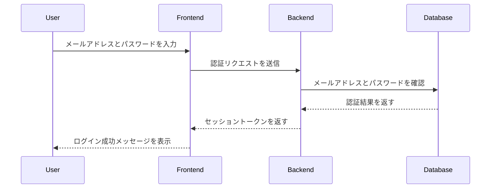
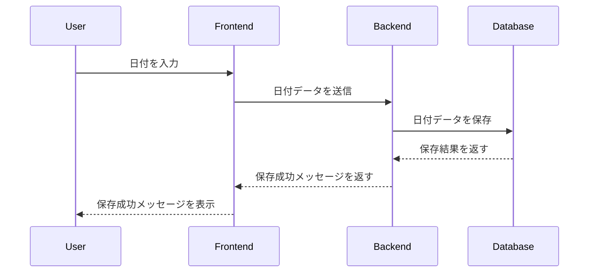
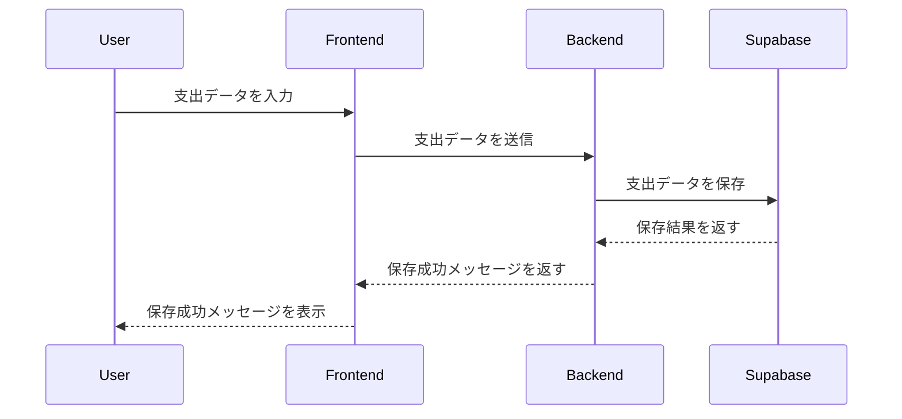

# バックエンド要件定義

## 1. ユーザ認証
### 機能概要
ユーザのメールアドレスとパスワードを使用して認証を行います。認証に成功した場合、セッションを開始し、トークンを発行します。

### 必要な情報
- メールアドレス
- パスワード

### フロー




## 2. 支出データの保存
### 機能概要
ユーザが入力した支出データをデータベースに保存します。

### 必要な情報
- 支出金額
- 使用用途
- 日付

### フロー

## 3. 使用用途の管理
### 機能概要
使用用途データを管理し、必要に応じて登録または削除を行います。

### 必要な情報
- 使用用途名
- 使用用途ID（オプション）

### フロー
```mermaid
sequenceDiagram
    participant User
    participant Frontend
    participant Backend
    participant Database

    User ->> Frontend: 使用用途を入力
    Frontend ->> Backend: 使用用途データを送信
    Backend ->> Database: 使用用途データを保存
    Database -->> Backend: 保存結果を返す
    Backend -->> Frontend: 保存成功メッセージを返す
    Frontend -->> User: 保存成功メッセージを表示

```mermaid
sequenceDiagram
    participant User
    participant Frontend
    participant Backend
    participant Database

    User ->> Frontend: 日付を入力
    Frontend ->> Backend: 日付データを送信
    Backend ->> Database: 日付データを保存
    Database -->> Backend: 保存結果を返す
    Backend -->> Frontend: 保存成功メッセージを返す
    Frontend -->> User: 保存成功メッセージを表示
```


## 4. 日付の管理
### 機能概要
支出データに紐付く日付を登録・取得・更新します。

### 必要な情報
- 日付
- 支出ID

### フロー


## 5. データの視覚化
### 機能概要
ユーザの支出データを取得し、グラフなどで視覚化します。

### 必要な情報
- ユーザID
- 表示期間

### フロー

```mermaid
sequenceDiagram
    participant User
    participant Frontend
    participant Backend
    participant Database

    User ->> Frontend: 視覚化リクエストを送信
    Frontend ->> Backend: 視覚化リクエストを送信
    Backend ->> Database: 支出データを取得
    Database -->> Backend: 支出データを返す
    Backend -->> Frontend: 視覚化データを返す
    Frontend -->> User: グラフを表示
```mermaid
sequenceDiagram
    participant User
    participant Frontend
    participant Backend
    participant Database

    User ->> Frontend: 日付を入力
    Frontend ->> Backend: 日付データを送信
    Backend ->> Database: 日付データを保存
    Database -->> Backend: 保存結果を返す
    Backend -->> Frontend: 保存成功メッセージを返す
    Frontend -->> User: 保存成功メッセージを表示
```


## 6. 機能間の関係
### 機能概要
各機能間の依存関係を示し、順番に処理される流れを視覚化します。

### フロー

```mermaid
sequenceDiagram
    participant ユーザ認証
    participant 支出データの保存
    participant 使用用途の管理
    participant 日付の管理
    participant データの視覚化

    ユーザ認証 ->> 支出データの保存: ユーザ認証完了後、支出データの保存が可能
    支出データの保存 ->> 使用用途の管理: 支出データ保存後、使用用途を管理
    使用用途の管理 ->> 日付の管理: 使用用途管理後、日付を管理
    日付の管理 ->> データの視覚化: 日付管理後、データを視覚化

