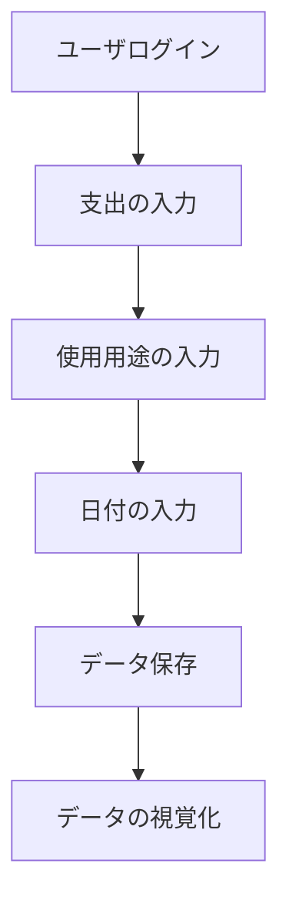

# フロントエンド要件定義

## 1. ユーザログイン
### 機能概要
- ユーザはメールアドレスとパスワードを使用してログインできる。
- ログイン後、ユーザのセッションを管理する。

### 必要な情報
- メールアドレス
- パスワード

### フロー
1. ログイン画面を表示
2. ユーザがメールアドレスとパスワードを入力
3. 入力内容をサーバに送信
4. サーバで認証を行い、成功した場合はセッションを開始

## 2. 支出の入力（Supabaseを使用）
### 機能概要
- ユーザは支出の金額を入力できる。
- 入力された支出データはSupabaseに保存される。

### 必要な情報
- 支出金額
- 支出のカテゴリ
- 支出の日付
- 使用目的
- 相手の情報

### フロー
1. 支出入力画面を表示
2. ユーザが支出金額、カテゴリ、日付、使用目的、相手の情報を入力
3. 入力内容をSupabaseに送信
4. Supabaseにデータを保存

## 3. 使用用途の入力
### 機能概要
- ユーザは支出の使用用途を入力できる。
- 使用用途はカテゴリとして管理される。

### 必要な情報
- 使用用途（カテゴリ）

### フロー
1. 使用用途入力画面を表示
2. ユーザが使用用途を入力
3. 入力内容をカテゴリとして保存

## 4. 日付の入力
### 機能概要
- ユーザは支出の日付を入力できる。
- 日付はカレンダーウィジェットを使用して選択できる。

### 必要な情報
- 支出の日付

### フロー
1. 日付入力画面を表示
2. ユーザがカレンダーウィジェットを使用して日付を選択
3. 選択された日付を保存

## 5. データの視覚化
### 機能概要
- 入力したデータを円グラフや棒グラフで視覚的に表示する。
- 月ごとの支出データをグラフで表示する。

### 必要な情報
- 支出データ

### フロー
1. データ視覚化画面を表示
2. ユーザが月を選択
3. 選択された月の支出データを取得
4. 円グラフや棒グラフでデータを表示

## 一連の流れの図

