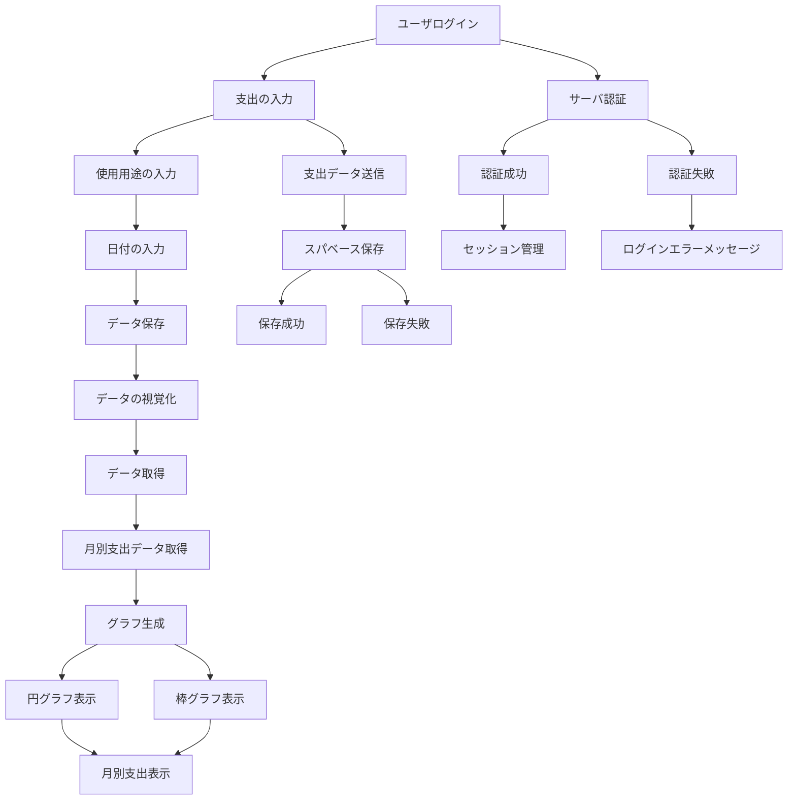

# フロントエンド要件定義

## 1. 使用技術スタック
- **Next.js**: サーバーサイドレンダリングと静的サイト生成のために使用。Reactの基盤を持ち、効率的なページロードを実現。
- **Tailwind CSS**: ユーザインターフェースのスタイリングをシンプルで効率的に行うために使用。
- **Supabase**: バックエンドサービス（認証、データベース）として使用。
- **Chart.js**: データ視覚化のために円グラフや棒グラフを生成するライブラリ。
- **React Hook Form**: フォームのバリデーションと管理を簡素化するために使用。

## 2. フロントエンドのコンポーネント構造
- **ログインページ (LoginPage)**: メールアドレスとパスワードを入力するフォーム。
- **支出入力ページ (ExpenseInputPage)**: 支出金額、カテゴリ、日付、使用目的などを入力するフォーム。
- **使用用途入力ページ (CategoryInputPage)**: 使用用途を追加するフォーム。
- **日付入力ページ (DateInputPage)**: 日付選択のカレンダーウィジェットを使用。
- **視覚化ページ (VisualizationPage)**: データをグラフで表示するページ。

## 3. データフロー

## 4. バックエンドとの連携

- **認証 (Auth)**:
  - ユーザはメールアドレスとパスワードでログイン。
  - 認証後、アクセストークンを取得して、後続のAPIリクエストに使用。
  - セッション管理: JWT（JSON Web Token）を使用して、クライアントとサーバ間でセッションを管理。

- **データ操作 (Supabase)**:
  - **支出データの保存**: 入力された支出情報（支出金額、使用用途、日付など）はSupabaseのデータベースに保存。
  - **データ視覚化**: 月ごとの支出データをSupabaseから取得し、Reactコンポーネントで表示。

## 5. コンポーネント間の通信

- **Context API / Redux**: ユーザのセッション情報や支出データの管理には、ReactのContext APIまたはReduxを使用。
- **API通信**: Axiosやfetchを用いて、バックエンド（Supabase）と通信し、データの送受信を行います。

## 6. データの視覚化

- **グラフ描画**: ユーザの月ごとの支出データを視覚化するために、Chart.jsライブラリを使用。円グラフや棒グラフを表示し、支出傾向を把握できるようにします。

## 7. エラーハンドリング

- **API通信のエラーハンドリング**: 入力エラーやネットワークエラーに対して、適切なエラーメッセージをユーザに表示。
- **バリデーション**: ユーザ入力をリアルタイムでバリデーションし、必須項目や形式に誤りがあった場合はフィードバックを提供。

## 8. セキュリティ対策

- **CSRF対策**: サーバとクライアント間でのセキュリティを強化するために、適切なCSRFトークンを実装。
- **HTTPS**: すべてのAPI通信はHTTPSを使用して、安全に行います。

