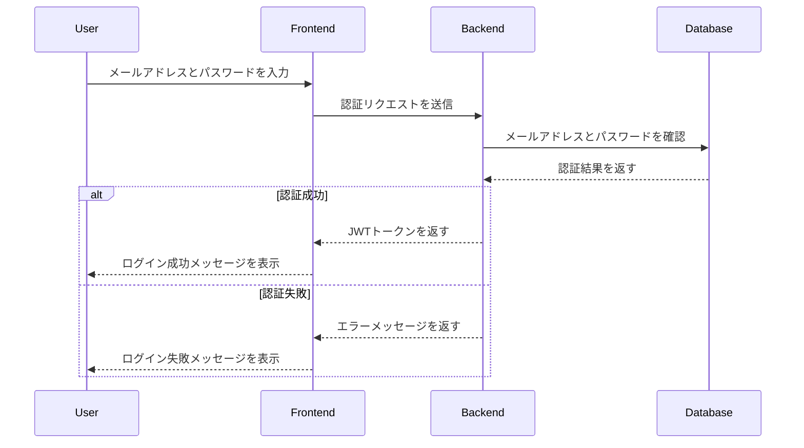

# ログイン機能仕様書

## 概要
ログイン機能は、ユーザが既に作成されたアカウントにアクセスし、セッションを開始するためのプロセスです。セキュリティを確保するために、ユーザの入力したメールアドレスとパスワードを検証し、有効であればセッション用のJWTトークンを発行します。

---

## 機能要件

### 必要な情報
- メールアドレス
- パスワード

### 機能仕様
1. ユーザが入力したメールアドレスとパスワードを受け取る。
2. データベース内の情報と照合し、認証を行う。
3. 認証成功時にJWTトークンを発行し、クライアントに返却。
4. 認証失敗時は適切なエラーメッセージを返却。

---

## バリデーション要件

1. **メールアドレス**
   - 必須項目。
   - 有効な形式（例: `example@example.com`）。

2. **パスワード**
   - 必須項目。
   - 8文字以上であること。

---

## 処理フロー



---

## APIエンドポイント定義

### 1. **ログインリクエスト**
- **エンドポイント**: `POST /auth/login`
- **リクエスト例**
  ```json
  {
      "email": "example@example.com",
      "password": "securePassword123"
  }
  ```
- **レスポンス例（成功時）**
  ```json
  {
      "token": "eyJhbGciOiJIUzI1NiIsInR5cCI6IkpXVCJ9...",
      "message": "Login successful"
  }
  ```
- **レスポンス例（失敗時）**
  ```json
  {
      "message": "Invalid email or password"
  }
  ```

---

## セキュリティ要件

1. **パスワードの検証**
   - データベース内のハッシュ化されたパスワードと入力されたパスワードを比較。
   - bcryptなどのハッシュ化アルゴリズムを使用。

2. **トークンの発行**
   - JWT（JSON Web Token）を生成。
   - トークンには以下の情報を含む:
     - ユーザID
     - トークンの有効期限（例: 1時間）

3. **HTTPS通信**
   - トークンやパスワードのやり取りはHTTPS経由のみで行う。

4. **エラーの一般化**
   - セキュリティ向上のため、認証失敗時に「メールアドレスまたはパスワードが無効」と表示。

---

## データベース設計

### 必要なテーブル
#### ユーザテーブル（`users`）
| カラム名      | 型          | 制約                     |
|---------------|-------------|--------------------------|
| id            | UUID        | プライマリキー           |
| email         | VARCHAR(255)| ユニーク制約             |
| password      | VARCHAR(255)| ハッシュ化済み           |
| username      | VARCHAR(50) | NULL許可（任意）         |
| created_at    | TIMESTAMP   | 自動生成                 |
| updated_at    | TIMESTAMP   | 自動生成                 |

#### トークンブラックリスト（オプション、`blacklist_tokens`）
| カラム名      | 型          | 制約                     |
|---------------|-------------|--------------------------|
| id            | UUID        | プライマリキー           |
| token         | TEXT        | トークン文字列           |
| created_at    | TIMESTAMP   | 自動生成                 |

---

## エラーハンドリング

| シナリオ                              | ステータスコード | レスポンスメッセージ                |
|---------------------------------------|------------------|------------------------------------|
| メールアドレスが未登録                | 401 Unauthorized | "Invalid email or password"       |
| パスワードが間違っている場合           | 401 Unauthorized | "Invalid email or password"       |
| サーバ内部エラー                      | 500 Internal Server Error | "An unexpected error occurred"    |

---

## 今後の拡張案

1. **多要素認証（MFA）**
   - ワンタイムパスワード（OTP）やSMS認証を導入。

2. **ログイン試行制限**
   - 特定のIPアドレスからの連続ログイン失敗を検知して制限。

3. **ソーシャルログイン**
   - GoogleやFacebookなどのOAuthプロバイダを利用した認証。

4. **トークンのリフレッシュ**
   - リフレッシュトークンを導入し、セッションを長期間維持。
